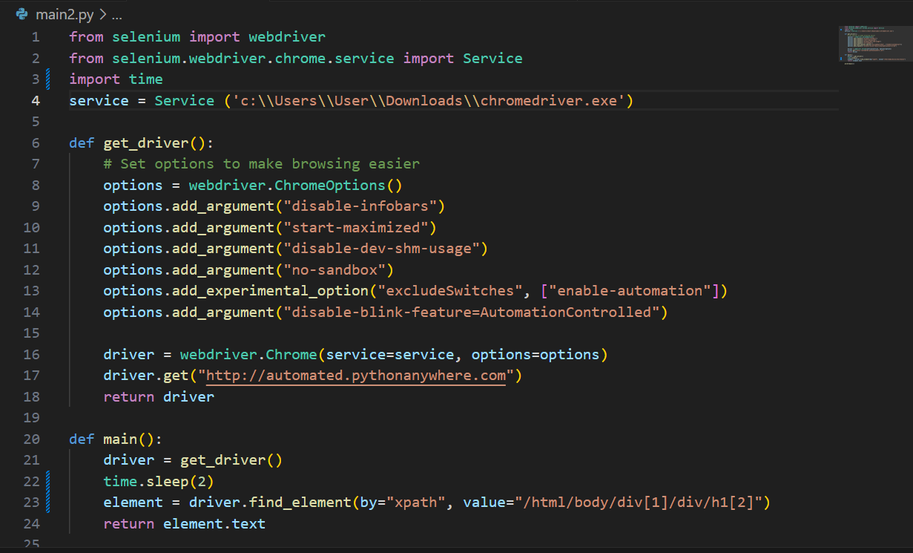

##  Website Scrapping with Python and Selenium

## The goal of this project is to scrap text from the following website:

-- Selenuim is a third party python library that can be used to automate browser actions such as coping text from a web page, clicking on a link, and more.

- Install Selenium after installing python and it is has been added to environmental variables ( Am using VScode on Windows o/s and python 3.12):
```
 > pip install selenium or python3 -m pip install selenium
```


- Write the following python script:
```
from selenium import webdriver

def get_driver():
    # Set options to make browsing easier
    options = webdriver.ChromeOptions()
    options.add_argument("disable-infobars") # disable inforbars that may interfer with the script #
    options.add_argument("start-maximized") # To access the max. size of the browser #
    options.add_argument("disable-dev-shm-usage") # to avoid any issue with accessing the browser on a linux workstation#
    # allows how script to have higher previleges #
    options.add_argument("no-sandbox") 

    # ensures our script with selenium to avoid detection from the browser #
    options.add_experimental_option("excludeSwitches", ["enable-automation"])
    options.add_argument("disable-blink-feature=AutomationControlled")

    driver = webdriver.Chrome(options=options)
    driver.get("http://automated.pythonanywhere.com")
    return driver

def main():
    driver = get_driver()
    element = driver.find_element(by="xpath", value="/html/body/div[1]/div/h1[1]")
    return element.text

print(main())
```
#### The webdriver is imported from  Selenuim module. webdriver is a tool that allows us to instruct the behaviour of the web browser which is accessible from python through selenium.
We create a driver variable and link it to the chrome class of the webriver.( it usually expects an executable path of the chromedriver it is automatically configure)
We create options and add aguments as explained in corresponding comments;
Add options to the webdrivers. options is an instance of the ChromeOptions. 
Then we link the driver to the web page to be scrapped using the "driver.get() and pass the url of the website as a string and return the driver for the webpage
Then we create another function with a variable driver that calls the function get_driver  and extract xpath of the inspect element. i.e the xpath of the text to be scrapped.

#### Output


#### Next we look at scrapping the dynamic figure from the website.

#### Inspect the browser page till the dynamic text is higlighted


#### Then copy the full xpath and replace it with the value of the element. Also you can import and time module to allow some delay then run the code

#### Output

#### Update the script to split the output such that only the dynamic number is retured

#### Output


#### Next we look at creating a script that logs in to the website by supplying a correct credential and then clicking on the home menu.

#### Output
